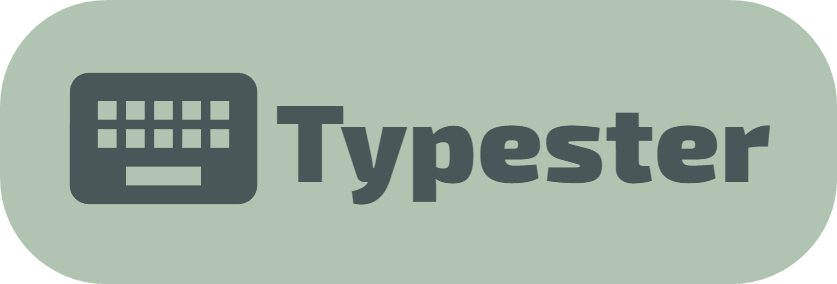

# Typester: A Typing App

Typester is a typing app designed to help users improve their typing speed and accuracy. You can check out the live version of the app by clicking on this [link](https://typester.vercel.app).

## Features

Here are some of the key features of Typester:

- **Random word generation.** Typester generates random words for users to type, so they can practice typing a variety of different words.
- **Responsive grid system for words.** Typester has a responsive grid system that adapts to different screen sizes and ensures that words are displayed correctly.
- **Auto scroll end of the line.** Typester automatically scrolls to the end of the line when a user reaches the end of the line while typing.
- **Typing cursor like cursor.** Typester has a typing cursor that behaves like a real cursor, making it easy for users to see where they are typing.
- **Cursor movement.** Typester moves the typing cursor back and forth using the word and character memory.
- **Deleting and word history system.** Typester has a word history system that allows users to see the words they have typed and delete them if necessary.
- **True and false word detection.** Typester detects whether users have typed the correct word or not and provides feedback accordingly.
- **Underlining wrong words.** Typester underlines incorrect words so that users can easily identify their mistakes.
- **Smooth cursor animation.** The typing cursor has a smooth animation that makes typing feel more natural and responsive.
- **Game mode with time.** Users can test their typing skills in game mode, which times them and records their net WPM, gross WPM, and accuracy.
- **NetWPM,GrossWPM,Accuracy calculation.** Typester calculates users' net WPM, gross WPM, and accuracy, so they can track their progress.
- **Cool animations.** Typester features some cool animations that make the app more fun to use.

## Future Improvements

Here are some of the improvements that I hope to implement in the future:

- **Auth and ranking system.** I plan to add an authentication system that allows users to create accounts and track their progress over time. I also plan to add a ranking system so that users can compete with each other.
- **Different game modes.** I plan to add different game modes that offer different challenges and help users practice different aspects of typing.
- **More settings.** I plan to add more settings that allow users to customize the app to their liking.
- **Theming.** I plan to add theming options that allow users to change the look and feel of the app.

Thank you for considering Typester for your typing needs. I hope you enjoy using the app! 🚀
